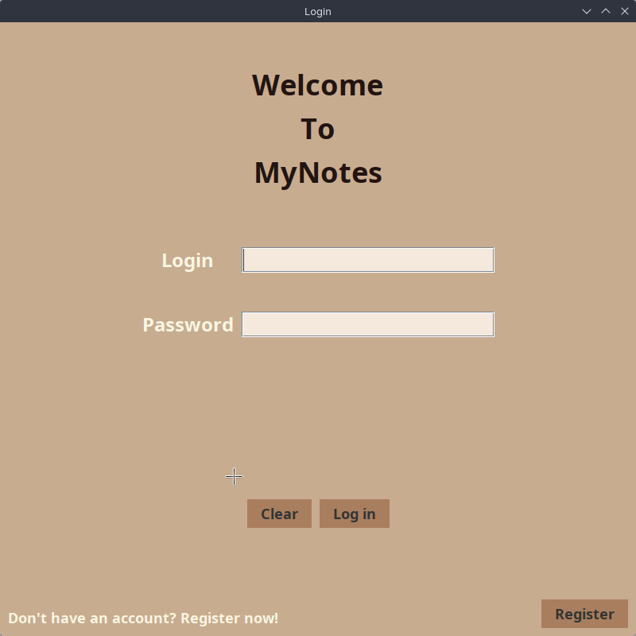
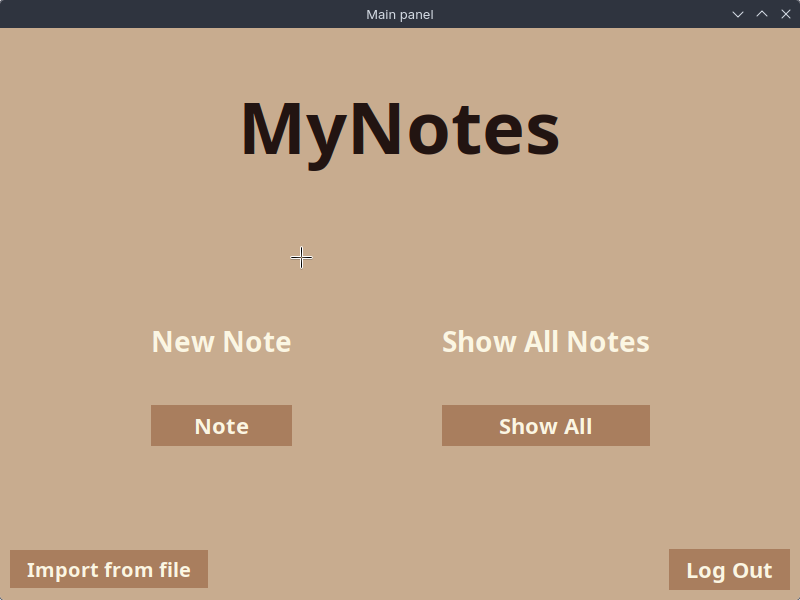
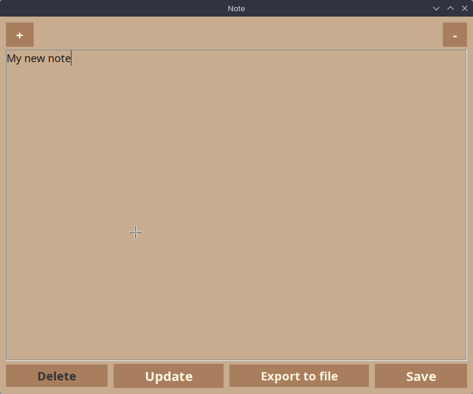

# Notatnik z Systemem Użytkowników (Java Swing)

Projekt aplikacji desktopowej służącej do zarządzania osobistymi notatkami. Aplikacja została stworzona w języku Java i oferuje pełną izolację danych dzięki systemowi rejestracji i logowania użytkowników.

## Główne Funkcjonalności

* **System Autoryzacji:** Logowanie i rejestracja nowych użytkowników.
* **Zarządzanie Notatkami (CRUD):** Tworzenie, wyświetlanie, edycja oraz usuwanie notatek przypisanych do konkretnego konta.
* **Trwałość Danych:** Integracja z bazą danych **PostgreSQL** zapewniająca bezpieczeństwo informacji.
* **Obsługa Plików:** Wykorzystanie biblioteki `OpenCSV` do importu i eksportu notatek.
* **Graficzny Interfejs (GUI):** Intuicyjne okienka zbudowane przy użyciu biblioteki `Java Swing` oraz `IntelliJ GUI Designer`.

## Technologie i Biblioteki

* **Język:** Java 
* **Interfejs:** Java Swing (pliki `.form`)
* **Baza danych:** PostgreSQL (sterownik `postgresql-42.7.1.jar`)
* **Biblioteki zewnętrzne:** * `OpenCSV` (obsługa plików .csv)
    * `Apache Commons Lang` (wsparcie operacji na stringach)
